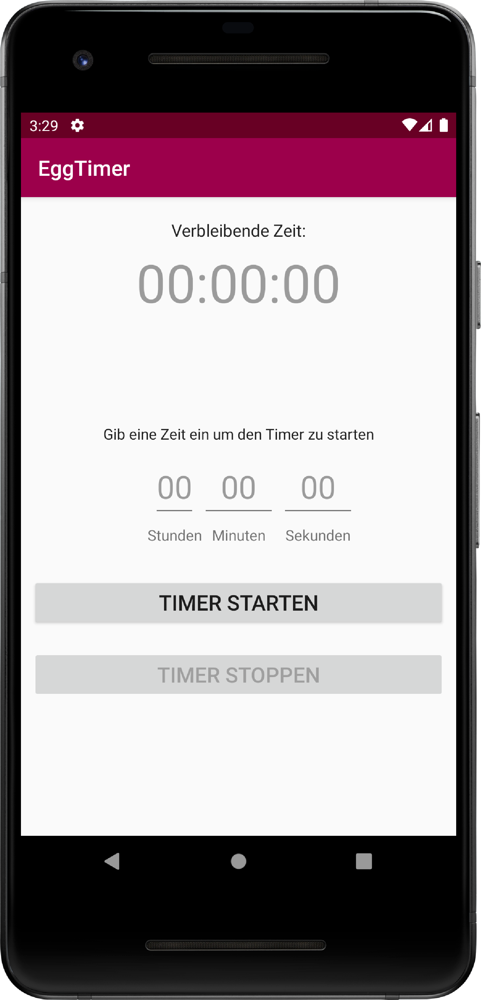
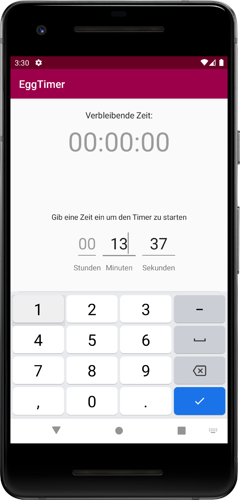
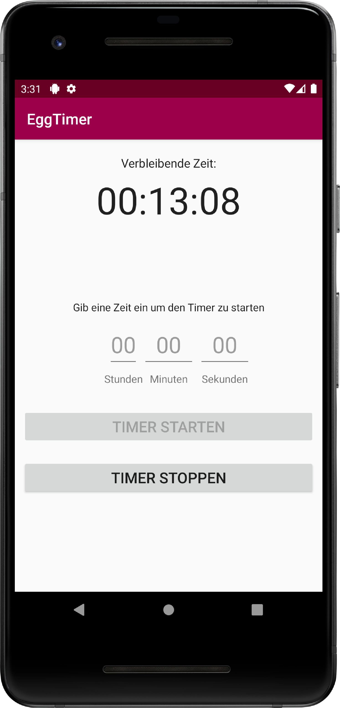
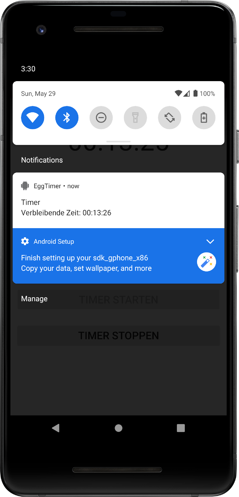

# U06 | Timer

## Aufgabe

In dieser Aufgabe implementieren Sie einen einfachen _Timer_, den Nutzer\*innen z.B. als Kurzeitmesser oder Eieruhr verwenden können. Dazu wählen diese eine beliebige Zeitdauer aus. Über _Notifications_ und _Toast_ werden die Nutzer\*innen  von der App informiert, sobald die Zeit abgelaufen ist. Über einen _Service_ und einen zusätzlichen _Thread_ verhindern wir, dass das _User Interface_ durch den _Countdown_ blockiert wird und stellen sicher, dass die Zeit auch dann korrekt herunter gezählt wird, wenn die Anwendung nicht im Vordergrund ist.

## Vorgaben

Im Starterpaket finden Sie eine Layout-Datei für die `TimerActivity`. Hier sind alle UI-Elemente für eine rudimentäre Umsetzung der Anwendungsidee bereits vorhanden. Die drei `EditText`-Elemente dienen der Eingabe der Zeit in Form von Stunden, Minuten und Sekunden. Über die beiden `Button`-Elemente wird der _Timer_ gestartet bzw. gestoppt.

### TimerStorage

Für die Umsetzung der Anwendungsidee ist es wichtig, den aktuellen Zustand des _Timers_, d.h., ob dieser aktuell "läuft" so abzuspeichern, dass diese Information auch nach einem Wechsel der Anwendung in den Hintergrund oder einem Schließen der Anwendung korrekt abgerufen werden kann. Zu diesem Zweck finden Sie im Starterpaket eine vorgegebene Klasse `TimerStateStorage`, die das Persistieren des Zustands in den _SharedPreferences_ erlaubt. Nutzen Sie diese Klassen an allen relevanten Stellen innerhalb Ihrer Lösung. Hinweise zur Verwendung finden Sie direkt im Code in Form von Kommentaren zur Klasse selbst und zu deren öffentlichen Methoden.

### BroadcastReceiver

Ein wichtiger Schlüssel zur erfolgreichen Implementierung der Anwendung ist das regelmäßige Kommunizieren des aktuellen Zustand des laufenden _Timers_. Das Android-Framework erlaubt es uns, über _Broadcasts_ relativ einfach, Nachrichten an beliebige Komponenten unsere Anwendung zu verschicken. _Broadcasts_ werden via Intent ohne explizite Zielangabe verschickt. Die Nachrichten werden über _Identifier_ (_Action_) eindeutig beschrieben. Komponenten, die sich im Vorfeld über einen _BroadcastReceiver_ für eine dieser _Actions_ registriert haben, empfangen die versendeten Nachrichten. Im Starterpaket finden Sie einen vorbereiteten _Receiver_ inkl. passendem _Listener_. Nutzen Sie diese Komponenten, um an den relevanten Stellen Ihrer Anwendung den aktuellen Zustand des _Timers_ per _Broadcast_ zu veröffentlichen, im _Receiver_ abzufangen und über den angegebenen _Listener_ zu verarbeiten.  

## Vorgehen

### Schritt 1 - Vorbereitung

Laden Sie da Starterpaket herunter und verschaffen Sie sich einen Überblick über den vorgegebenen Code. Starten Sie die App im Emulator um sicherzustellen, dass keine Fehler auftreten.

**Zwischenziel:** Das Starterpaket lässt sich problemlos öffnen und die vorbereitete Anwendung kann im Emulator ausgeführt werden.

### Schritt 2: Eingaben der Nutzer\*innen auslesen

Sorgen Sie dafür, dass beim Klick auf den _Start_-Button die aktuellen Werte aus den drei Eingabefeldern ausgelesen werden. Die Angaben zu Stunden, Minuten und Sekunden werden zu einem Gesamtwert zusammengerechnet, der die von den Nutzer\*innen eingegebene Zeit in Sekunden ausdrückt. Geben Sie die berechnete Zeit testweise über die `Log.d`-Methode aus. Fangen Sie zusätzlich Klicks auf den _Stop_-Button ab und geben Sie in der _Callback_-Methode zuerst ebenfalls nur einen passenden _Debug_-Text aus.

**Zwischenziel:** Nutzer\*innen können die Zeit für den _Timer_ einstellen. Die Anwendung reagiert intern auf Klicks auf die beiden Buttons. Beim Versuch, den _Timer_ zu starten, wird die eingegeben Zeit als Debug-Ausgabe ausgegeben.

### Schritt 3:  Der Timer

Erstellen Sie eine neue Klasse `Timer`. Hier wird das herunterzählen der eingegebene Zeit implementiert. Die Klasse soll über öffentliche Methoden zum Starten bzw. Stoppen des _Timers_ verfügen. Beim Aufruf der Start-Methode wird die Zeit übergeben, die im _Timer_ heruntergezählt werden soll. Status-Updates werden aus der Klasse heraus über eine einfache _Listener_-Schnittstelle kommuniziert. Ergänzen Sie ein entsprechende Interface, dass Methoden vorgibt, mit dem die Listener über die verbleibende Zeit, das erfolgreiche Ende und das vorzeitige Abbrechen des Timers informiert werden können. Beim Erstellen des `Timer`-Objekts soll dem Konstruktor ein entsprechender _Listener_ übergeben werden.

**Arbeiten im Hintergrund**

Die ablaufende Zeit soll im Hintergrund gezählt werden, um zu verhindern, dass der _UI-Thread_ der Anwendung dadurch blockiert wird. Nutzen Sie die Klassen bzw. Interfaces `Runnable`, `Executor` und `ScheduledExecutorService` zur Umsetzung dieser Funktionalität:

- Das _Runnable_ soll regelmäßig ausgeführt werden. Bei jeder Ausführung wird die verbleibende Zeit des _Timers_ geprüft. Wenn die Zeit komplett abgelaufen ist, wird der Listener, den Sie an das `Timer`-Objekt übergeben haben, darüber informiert. Ist das Ende noch nicht erreicht, wird der selbe Listener über die noch verbleibende Zeit informiert. Überschreiben Sie dazu die `run`-Methode des _Runnable_ und implementieren Sie dort die beschriebene Programmlogik. Sie können entweder die `Timer`-Klasse selbst zum _Runnable_ machen (Vererbung) oder intern eine neue _Runnable_-Instanz erstellen. 
- Die `Executors`-Klasse erlaubt den Zugriff auf die Komponeten der Java-Laufzeitumgebung, die für das Ausführen von Hintergrundoperationen zuständig sind. Nutzen Sie die statische Methode `newSingleThreadScheduledExecutor` um eine `ScheduledExecutorService`-Instanz zu erzeugen, mit der Sie das vorbereitet _Runnable_ später in regelmäßigen Abständen (z.B. eine Sekunde) aufrufen können.
- Über die Methode `scheduleWithFixedDelay` des `ScheduledExecutorService` können Sie jetzt das regelmäßige Prüfen des _Timers_  über das _Runnable_ auslösen. Dazu übergeben Sie der Methode neben dem _Runnable_ auch den initialen Delay sowie den Abstand zwischen den zukünftigen Ausführen des _Runnables_. Die Methode startet den Vorgang automatisch und gibt Ihnen ein `ScheduledFuture`-Objekt zurück, dass Sie in einer Instanzvariable der `Timer`-Klasse abspeichern sollten. Über die Methoden des Objekts können Sie u.a. die ständigen Aufrufe des _Runnables_ stoppen. 

Nutzen Sie die öffentlichen Methoden der `Timer`-Klasse um das _Runnable_ zu starten bzw. zu stoppen. Erzeugen Sie in der _Activity_ der Anwendung einen neuen `Timer`, der die _Activity_ als Listener kennt. Starten Sie den Timer, nachdem die Nutzer\*innen auf den _Start_-Button geklickt haben und übergeben Sie dabei die Zeit in Sekunden, die Sie über die vorher implementierte Methode aus dem UI ausgelesen haben. Fangen Sie die Status-Updates des _Timers_ in der Activity ab und testen Sie deren Empfang über geeignete Log-Ausgaben.

**Achtung:** Denken Sie schon jetzt daran, den aktuellen Zustand des _Timers_ sicher zu speichern. Nutzen Sie dazu die vorbereitete `TimerStateStorage`-Klasse aus dem Starterpaket.

**Zwischenziel:** Beim Klick auf den Start-Button wird ein _Timer_ für die eingegebene Zeit gestartet. Während der Ausführung des _Timers_ wird die verbleibende Zeit regelmäßig als Log-Ausgabe in der Debugging-Konsole angezeigt. Nach Ablauf der eingestellten Zeit enden die regelmäßigen Updates. Der vollständige Durchlauf des _Timers_ wird über eine letzte Debug-Ausgabe kommuniziert.
 
### Schritt 4: Aktualisieren des UIs

Sorgen Sie dafür, dass die verbleibende Zeit korrekt im UI angezeigt wird. Nutzen Sie dazu die bereits implementierte Verbindung zwischen _Timer_ und _Activity_. Jedes Mal, wenn in der _Activity_ die verbleibende Zeit in der implementierten Methoden des Listener-Interface eingeht, erzeugen Sie aus der Angabe einen lesbaren String im Format (HH:MM:SS) und tragen diesen im entsprechenden `TextView` ein. Sobald der _Timer_ vollständig durchgelaufen ist oder vorzeitig abgebrochen wird, tragen Sie im `TextView` wieder den _Default_-Wert `00:00:00` ein. Sorgen Sie im Anschluss dafür, dass die Nutzer\*innen den laufenden _Timer_  über einen Klick auf den entsprechenden _Button_ abbrechen können.

**Zwischenziel:** Während der _Timer_ läuft, wird die verbleibende Zeit im UI angezeigt. Die Anzeige wird regelmäßig aktualisiert. Der _Timer_ kann von den Nutzer\*innen abgebrochen werden. Nach dem Beenden des Timers wird im UI wieder der Default-Wert an Stelle der verbleibenden Zeit angezeigt.

### Schritt 5: Auslagern in einen Service
1
Setzen Sie nun den wichtigen [Vordergrund-_Service_](https://developer.android.com/guide/components/foreground-services) für Ihre Anwendung um, in dem Sie eine Klasse erstellen, die von `Service` erbt.  Dieser Dienst sorgt später dafür, dass der _Timer_ auch dann weiterläuft, wenn die App nicht mehr aktiv ist, z.B. weil die _Activity_ in den Hintergrund verschoben wurde. Sorgen Sie durch den Methodenaufruf `startForeground()` in der `onCreate`-Methode des _Service_ dafür, dass dieser im Vordergrund läuft. Android verlangt dabei, dass der gestartete _Service_ eine _Notifiation_ verschickt, damit den Nutzer\*innen klar ist, dass noch Teile der App aktiv sind, auch wenn ggf. keine Activity mehr im Vordergrund sichtbar ist. Das Erstellen und Versenden von _Notifications_ wird im [Create a Notification Guide](https://developer.android.com/training/notify-user/build-notification) der Android-Dokumentation erklärt. Beachten Sie hier vor allem, dass Sie einen eigenen _Notification Channel_ für diesen Teil der Anwendung erstellen müssen, über welchen später die _Notifications_ verschickt werden.  Weitere allgemeine Informationen zum Thema _Services_ finden Sie in der [Android-Dokumentation](https://developer.android.com/guide/components/services).

**Hinweis:** Spätestens hier sollten Sie sich Gedanken über die Struktur Ihrer Anwendung machen. Für den Umgang mit _Notifications_ wird zusätzlicher _Code_ benötigt. Um die `Service`-Klasse nicht unnötig komplex zu gestalten, können Sie die notwendigen Methoden für die Steuerung der _Notifications_ in eine separate Klasse auslagern, die dann vom _Service_ genutzt wird.

Verwenden Sie den vorbereiteten _Timer_ in dem neu erstellten Service. Der _Timer_ kommuniziert jetzt nicht mehr mit der _Activity_, sondern mit dem _Service_, der dafür das entsprechende _Interface_ implementieren muss. Die _Updates_ zum Status des _Timers_ müssen trotzdem noch die _Activity_ erreichen. Nur so kann, während die Anwendung im Vordergrund ist, das UI korrekt angepasst werden. Versenden Sie im _Service_ dafür [Broadcasts](https://developer.android.com/guide/components/broadcasts#context-registered-receivers), die in der _Activity_ über einen _Receiver_ empfangen werden. Die notwendigen Klassen und Schnittstellen haben wir bereits vorbereitet und weiter oben erklärt. Nutzen Sie die Methode `onStart` der _Activity_, um den _BroadcastReceiver_ im System zu registrieren. In der Methode `onStop` wird die Registrierung des _Receiver_ aufgehoben (`this.unregisterBroadcastReceiver()`).

**Zwischenziel:** Bei einem Klick auf den _Start_-Button wird nun ein _Service_ gestartet, der jetzt den _Timer_ verwaltet. Die relevanten _Updates_ gehen per _Broadcast_ in der _Activity_ ein. Alle bereits implementierten Funktionen der Anwendung funktionieren weiterhin. Über den Start des _Timers_ werden die Nutzer\*innen über eine _Notification_ informiert. Beim Klick auf die _Notification_ wird die Anwendung in den Vordergrund verschoben.

### Schritt 6: Besser Notifications 

Der Titel und Inhalt einer _Notification_ lässt sich anpassen bzw. aktualisieren. Dazu überschreiben Sie eine bestehende _Notfication_ mit einer neuen, der Sie die selbe ID geben.. Das Android-System kümmert sich darum, dass die bereits bestehende _Notification_ angepasst bzw. ersetzt wird. Nutzen Sie diesen Mechanismus, um die aktuell verbleibende Zeit des _Timers_ auch in der _Notification_ anzuzeigen. Sorgen Sie zusätzlich dafür, dass die Nutzer\*innen über die _Notification_ über den vollständigen Durchlauf des _Timers_ oder  dessen vorzeitigem Abbruch informiert werden.

**Zwischenziel:** Jedes Mal, wenn der _Service_ vom _Timer_ über die noch verbleibende Zeit informiert wird, wird die _Notification_ angepasst, und die aktualisierte Restzeit angezeigt. Die _Notification_ wird nach erfolgreichem Durchlauf des _Timers_ oder dessen vorzeitigem Abbruch angepasst um den jeweiligen Zustand der Anwendung zu reflektieren.

### Feinschliff

Die App funktioniert nun auch, wenn Sie im Hintergrund läuft, allerdings nicht wenn sich das Smartphone im _Standby_-Modus befindet. Damit die App auch dann noch Rechenleistung von der CPU bekommt, muss ein _WakeLock_ implementiert werden. Orientieren Sie sich bei der Umsetzung an [diesem Tutorial](https://developer.android.com/training/scheduling/wakelock#cpu).

Als letztes sorgen Sie dafür, dass beim Öffnen der App, vor allem dann, wenn diese aus dem Hintergrund geholt wird, der korrekte Zustand im _UI_ angezeigt wird. Lesen Sie dazu in den relevanten _Life-Cycle_-Methoden der _Activity_ die Werte aus, die Sie im _Timer_ über die _TimeStateStorage_-Klasse gespeichert haben. Passen Sie den Zustand der _Buttons_ und den Inhalt des `TextViews` entsprechend an.

## Screenshots der Anwendung

|  App nach dem Start  | Eingabe durch Nutzer\*innen | Laufender Timer | Notification | 
|:------:|:-------:|:-------:|:-------:|
|    |    |    |    | 